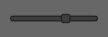

# Widgets for Bevy UI

A collection of components and widgets that are built for bevy_ui and the ECS pattern.

## Current State

This was started recently and is still under development. This is still just an experiment and it's unclear if and when a first release will be made available. I will be iterating over different API's and implementations to find what works and what doesn't.

## Design Goals
- **Simple**: Use thin abstractions over the ECS pattern
- **Modular**: Features should be extensible, customizable and replaceable
- **Bevy-native**: Build on top of existing Bevy features without a third-party UI library

## Built for bevy_ui and ECS

The bevy_ui crate is lacking in some areas, but the main features required to create simple UIs are there. I noticed that most UI libraries for Bevy were actually bevy plugins that adapt third-party renderers, so I decided to start thinking about what was lacking to make building "Bevy-native" UIs simpler. This library attempts to fill some of those gaps only using thin abstractions over Bevy, with the idea that some of those abstractions could become good enough to be merged to bevy_ui at some point. This means that using this library in its actual state will only remove _some_ of the UI boilerplate code, and not _most_ of it.

## Library Features

### UI Components

This library provides multiple new components that can be used as building blocks to add behavior to UI nodes. These behaviors are implemented in systems that are provided by multiple different plugins, so that you can use only what you need. Following the data-oriented principles of ECS, those building blocks can be mixed and matched to compose UIs. This hopefully reduces the amount of systems that need to be written to implement basic functionalities compared to using raw bevy_ui.

Of course, some building blocks may not make sense together and may even "fight" each other. This is normal in a data-driven design and it's up to the documentation and to implementations to try to reduce the amount of problems this can cause to users of the library.

### Widget Builders

In the current state of this library, a widget is really just a group of components and systems that expect a specific hierarchy structure and share the common goal of rendering something useful to the UI.

A widget builder is therefore really just a thin abstraction layer that helps you spawn the right hierarchy of entities expected for those components and systems to work properly. The widget builders provided by this library also offer convenient ways to interact with that creation, so that everything is 100% customizable.

### Slider Widget Example

As an example, the `SliderWidgetPlugin` comes with a bunch of components and systems tailored to render an interactive slider with variable minimum, maximum and steps value. The `SliderWidgetBuilder` will spawn the following hierarchy of UI bundles:

```
|- Root: SliderBundle
   |- Track: NodeBundle + SliderTrackNode + RootEntity
   |- Thumb: NodeBundle + SliderThumbNode + RootEntity + Grab
```

Here, `SliderBundle` is a variation of NodeBundle with extra slider-specific components.

The builder also exposes methods that allow you to edit each bundle before it is spawned and allow you the run entity commands on each spawned entity individually so that you can add or remove components and even children. For example, you could edit the root's `SliderBundle` to customize the minimum, maximum and step values of the slider. You could then use Thumb entity commands to insert an `InteractionCursorIcon` component to show a "grab" cursor when hovered.

See the [slider example](/examples/slider.rs) for a concrete example of spawning a slider widget.

## Widgets List

### Frame

A frame is like a window that exists in the UI of your application. A frame has a title bar with a close button, and it can have any content inside of it. It can be moved around, resized, minimized and closed.


### Tooltip

A tooltip is a box that "floats" over other UI elements and contains some text.

Tooltips are useful to display additional information to users when they mouse-over or select something on the screen.


### Slider

A slider allows to make selections from a range of values.


